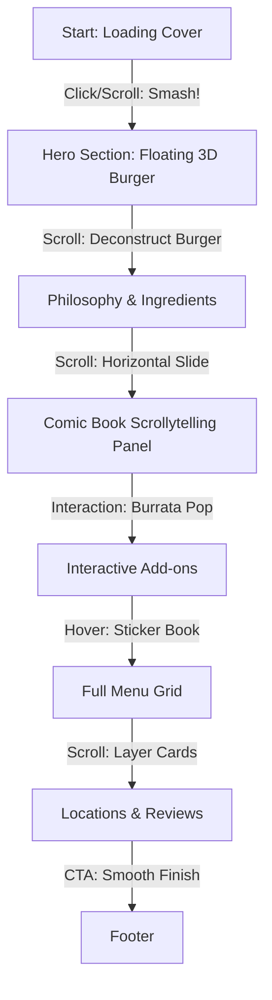

# Smash Guys: Cinematic Website Redesign Proposal

This proposal outlines a set of premium, high-impact design and interaction concepts to transform the **Smash Guys Burger Kitchen** website into a world-class, cinematic digital experience. 

It bridges the brand's raw **"Pop Art / Comic Book / American Diner"** style (as established in the PDF menu) with state-of-the-art web motion technologies (GSAP, scroll-driven animations, SVG morphing, and custom cursor physics).

---

## 1. Core Brand Identity Elements (Studied from PDF Menu)
To ensure the website remains authentic, all cinematic elements should align with these key visual tokens:
*   **Palette:** Warm Cream base (`#FFFDF6`), Vibrant Golden Yellow (`#FFC72C`), and high-contrast Obsidian Black (`#0B0B0B`).
*   **Typography:** The structural, uppercase, condensed **Oswald** (Display) contrasted with the fluid, hand-drawn, cursive **Caveat** (Script) for key highlights.
*   **Motifs:** Thick black border outlines, two-tone yellow checkerboard grids, cartoon "bursts" or "splashes," stars (`★`), and hand-drawn line-art stickers (chili peppers, chef hats, burger silhouettes).
*   **Materiality:** A tactile, paper-like grain texture overlaying the entire website to simulate a physical printed menu.

---

## 2. Eight Cinematic Interaction Concepts

### 1. The "Smash" Entrance (Hero Reveal)
*   **Visual Concept:** The page loads with a full-screen, high-contrast yellow-and-black checkerboard cover. In the exact center is a large, closed white box with black outline stars (`★ ★ ★ ★ ★ ★ ★`), matching the cover of the menu.
*   **Interaction:** 
    *   Hovering over the central box makes it wobble and shake using GSAP physics, emitting tiny vector star particles (`★`) that scatter and fade.
    *   On click (or scroll), a giant cartoon text balloon displaying **"SMASH!"** bursts onto the screen.
    *   The checkerboard doors slide open horizontally (left and right) with a motion-blurred transition, revealing the animated hero section.
*   **Technical Implementation:** GSAP Timeline with CSS `clip-path` or `transform: scaleX(0)` transitions.

### 2. Exploded 3D Burger Scroll (Layer-by-Layer Storytelling)
*   **Visual Concept:** A high-definition, realistic burger (made of layered PNGs or a WebGL model) floats in the center of the viewport as the user scrolls.
*   **Interaction:** 
    *   As the user scrolls down, the burger deconstructs vertically in space.
    *   The top bun floats up, the cheese melts down, the double smash patties separate, revealing the pickles, grilled onions, and mustard.
    *   Floating text labels with hand-drawn black pointers slide in, highlighting premium details: *"80/20 Fresh Buff Blend"*, *"Aged Cheddar Melt"*, *"Scribbled Mustard"*.
*   **Technical Implementation:** GSAP `ScrollTrigger` scrubbing the `translateY` values of individual layered images.

### 3. The "Comic Strip" Scrollytelling Panels
*   **Visual Concept:** The page transition shifts from vertical scrolling to a horizontal comic book strip grid, highlighting the brand story ("Built in Public on YouTube" and "AB & Nikhil Gupta").
*   **Interaction:**
    *   The screen snaps into a layout of bordered panels.
    *   Scrolling drives the camera left-to-right (horizontal scroll scrub).
    *   Inside the panels, line-art drawings animate (e.g., a YouTube play button wobbles, a neon location pin drops onto a Bangalore map with a yellow highlight scribble, and a burger patty gets smashed with a dynamic `CRUNCH!` comic bubble).
*   **Technical Implementation:** Lenis horizontal scroll snapping + CSS Grid with GSAP-controlled viewports.

### 4. Interactive "Burrata Dollop" Mask Morphing
*   **Visual Concept:** The PDF highlights the *Smashed Truffle Burrata* add-on as *"an irresistible layer of creamy indulgence."*
*   **Interaction:**
    *   When the user reaches the Burrata menu item, the cursor morphs into a hand-drawn fork.
    *   Clicking on the burrata graphic triggers an SVG path morphing animation where the cheese "bursts" and slowly oozes down the burger patty.
    *   This effect scrubs with the scroll, so scrolling makes the cheese drip further, creating a mouth-watering visual.
*   **Technical Implementation:** SVG path morphing (GSAP `MorphSVGPlugin` or CSS path transitions) overlaying the burger image.

### 5. Dino Bone Marrow "Jus Pour" Effect
*   **Visual Concept:** Highlighting the premium *Flintstone* burger, which is served with a dino bone marrow and home-made jus.
*   **Interaction:**
    *   As the section enters the screen, a large bone marrow bone tilts from the top-right.
    *   A rich, glistening stream of jus (gravy) is animated pouring down directly onto the burger.
    *   The pour effect reacts to scroll speed: scrolling faster makes the gravy pour heavier, and stopping the scroll pauses the drip.
*   **Technical Implementation:** HTML5 Canvas fluid simulation or a custom CSS sprite-sheet animation triggered via scroll-velocity tracking.

### 6. Interactive Sticker Book Canvas
*   **Visual Concept:** Scattered throughout the background are faint outline sketches of the menu stickers (e.g., `NEW`, `CHEF`, `SPICY`, outline fries, stars).
*   **Interaction:**
    *   These outlines function like interactive stickers on a laptop case.
    *   Hovering over them causes them to wiggle, fill with vibrant yellow, and cast a soft drop shadow.
    *   Users can click and drag any sticker, placing it anywhere on the page. The sticker "sticks" with a satisfying wobble animation.
*   **Technical Implementation:** HTML5 Drag & Drop API or GSAP `Draggable` utility.

### 7. Kinetic Typography & Outline Morphing
*   **Visual Concept:** The contrast between the heavy block Oswald headers and the loose cursive Caveat script.
*   **Interaction:**
    *   Huge background headers (e.g., "SMASH GUYS BURGER KITCHEN") scroll in opposite directions at different speeds behind the content cards (parallax typography).
    *   The letters start as hollow black outlines and fill in with solid black or yellow as they cross the center of the screen.
    *   Cursive annotations (like *"Must Try!"* or *"Eggless!"*) scribble onto the page as if being drawn in real-time by an invisible marker.
*   **Technical Implementation:** CSS `text-stroke` transition + SVG `stroke-dashoffset` path drawing animation.

### 8. Diner Menu Card Dealing Transition
*   **Visual Concept:** Sections do not simply scroll upwards; they slide over one another like physical diner menus or playing cards being dealt onto a wooden table.
*   **Interaction:**
    *   The previous section slides down slightly and darkens, while the new section slides over it with a soft paper shadow cast on the layer beneath.
    *   A subtle tilt-shift perspective is applied to the incoming cards, making them feel 3D.
*   **Technical Implementation:** CSS 3D transforms (`rotateX`, `perspective`) combined with GSAP ScrollTrigger pinning.

---

## 3. Section-by-Section Enhancements

### A. Navigation & Header
*   **Upgrade:** Replace the simple text links with hover states that trigger a yellow marker scribble underneath, using a hand-drawn SVG path animation.
*   **Cinematic Touch:** The "Order Now" button in the top-right should have a magnetic pull effect towards the user's cursor.

### B. Hero Section
*   **Upgrade:** Instead of a static burger emoji, integrate the **Exploded Burger Scroll** or a floating 3D parallax rendering that shifts subtly based on mouse movement.
*   **Cinematic Touch:** The sliding marquee ticker should speed up or slow down based on scroll speed.

### C. Signature Carousel
*   **Upgrade:** Add micro-animated navigation arrows at the edges of the horizontal carousel that only appear on hover, accompanied by a slim horizontal progress bar underneath that fills as the user scrolls through the items.
*   **Cinematic Touch:** When a card is hovered, the surrounding cards dim and blur slightly, drawing absolute focus to the hovered signature item.

### D. Full Menu Grid
*   **Upgrade:** The static pop-up badges (`CHEF`, `SPICY`, etc.) should animate when the row is hovered (e.g., the chili pepper badge shakes, and the chef hat badge tilts).
*   **Cinematic Touch:** Hovering a menu row reveals a floating, low-opacity thumbnail photo of the dish following the cursor.

---

## 4. Technical Implementation Pathway

1.  **Lenis Smooth Scroll:** Adjust the smooth scroll parameters (duration, easing) in the `LenisProvider` to make scrolling feel slightly heavier and fluid, matching the organic diner menu experience.
2.  **GSAP Setup:** Use GSAP `ScrollTrigger` for all scroll-scrubbed animations (burger deconstruction, text fills, card pins).
3.  **Performance Optimization:** Ensure all heavy food photography is optimized (Next.js `<Image />` component with WebP format), and use CSS transitions or canvas for animations to maintain a stable 60 FPS frame rate.
