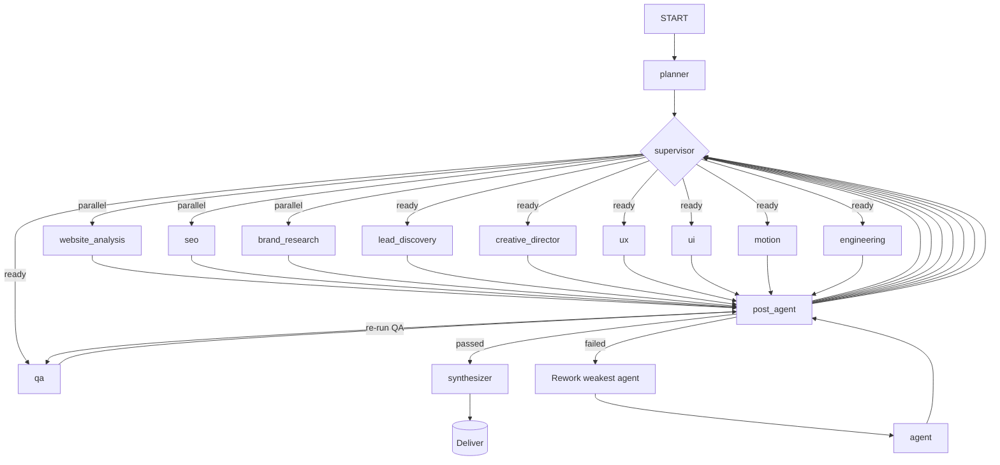

# Pipeline Guide: One-Command Cinematic Website Generation

> **Goal:** Transform any website into a high-end, cinematic digital experience with a single command.
> **Command:** `python scripts/run_pipeline.py "Redesign https://razorpay.com into a cinematic fintech platform" --project razorpay`

---

## 1. How the Pipeline Works (End-to-End)

### 1.1 The Big Picture

The platform is a **multi-agent AI workforce** that behaves like a premium digital agency. Given one sentence, it:

1. **Crawls** the target site
2. **Researches** the brand, competitors, and audience
3. **Discovers leads** — finds high-value companies via Google Maps / LinkedIn / Clutch / Crunchbase, analyzes their websites, scores SEO, design, and business maturity, then ranks the top 20 prospects with personalized redesign proposals
4. **Directs** the art direction (moodboards, color systems, typography)
5. **Plans** the UX (sitemap, wireframes, conversion strategy)
6. **Designs** the UI (design tokens, components, responsive layouts)
7. **Specs** the motion (animations, scroll narrative, micro-interactions)
8. **Engineers** the production code (Next.js + React + TypeScript + Tailwind + Three.js)
9. **QA** the output (responsiveness, lighthouse, accessibility, SEO, performance, animation, consistency)
10. **Delivers** a zipped project + 10 Markdown reports

### 1.2 One-Command Execution

```bash
# Simulation mode (no API keys needed — uses deterministic templates)
python scripts/run_pipeline.py "Redesign https://example.com into a cinematic site"

# Production mode (real AI generation)
LLM_PROVIDER=openai \
OPENAI_API_KEY=sk-... \
SEARCH_PROVIDER=tavily \
SEARCH_API_KEY=tvly-... \
python scripts/run_pipeline.py "Redesign https://example.com into a cinematic site"
```

**Output:**
- `artifacts/projects/{project_id}/` — generated Next.js project
- `artifacts/projects/{project_id}/reports/` — 10 Markdown reports
- `artifacts/projects/{project_id}/project.zip` — deploy-ready zip

---

## 2. Pipeline Flowchart

### 2.1 High-Level Flow

```
USER REQUEST (natural language)
        │
        ▼
┌─────────────────────────────────────────────────────────────┐
│  START                                                      │
└───────────────────────┬─────────────────────────────────────┘
                        │
                        ▼
┌─────────────────────────────────────────────────────────────┐
│  PLANNER (Master Orchestrator)                               │
│  • Parse URL from request                                    │
│  • Build task graph with dependencies                        │
│  • Validate topology (fixed, never trusted to LLM)           │
└───────────────────────┬─────────────────────────────────────┘
                        │ task_plan
                        ▼
┌─────────────────────────────────────────────────────────────┐
│  SUPERVISOR (Router / Scheduler)                             │
│  • Check task_status + dependencies                          │
│  • Dispatch ready tasks in parallel (LangGraph Send)         │
│  • Route through post_agent after each completion            │
│  • Deadlock guard: synthesize if stuck                       │
└───────────────────────┬─────────────────────────────────────┘
                        │
         ┌──────────────┼──────────────┐
         │              │              │
         ▼              ▼              ▼
┌─────────────┐  ┌─────────────┐  ┌─────────────┐
│ Website     │  │ SEO         │  │ Brand       │
│ Analysis    │  │             │  │ Research    │
│ (parallel)  │  │ (parallel)  │  │ (parallel)  │
└──────┬──────┘  └──────┬──────┘  └──────┬──────┘
       │                │                │
       └───────────────┼────────────────┘
                       │ all parallel tasks done
                       ▼
           ┌───────────────────────┐
           │ Lead Discovery        │
           │ (Google Maps /        │
           │  LinkedIn / Clutch /  │
           │  Crunchbase)          │
           └───────────┬───────────┘
                       │
           ┌───────────┼───────────┐
           ▼           ▼           ▼
       ┌───────┐  ┌───────────┐  ┌───────────┐
       │ Creative│  │ UX         │  │ UI Design  │
       │ Director│  │            │  │            │
       └───┬────┘  └─────┬─────┘  └─────┬─────┘
           │              │              │
           │              │         ┌────┴────┐
           │              │         │ Motion  │
           │              │         │ Design  │
           │              │         └────┬────┘
           │              │              │
           └──────────────┼──────────────┘
                           ▼
                   ┌─────────────┐
                   │ Engineering │
                   │ (Next.js    │
                   │  code gen)  │
                   └──────┬──────┘
                          │
                          ▼
                   ┌─────────────┐
                   │ QA          │
                   │ (7-dim      │
                   │  score)     │
                   └──────┬──────┘
                          │
                          ▼
                   ┌─────────────┐
                   │ Synthesizer │
                   │ • Save files│
                   │ • Generate  │
                   │   reports   │
                   │ • Zip       │
                   └──────┬──────┘
                          │
                          ▼
                   ┌─────────────┐
                   │ END         │
                   │ FinalArtifact│
                   └─────────────┘
```

### 2.2 Detailed Agent Flow



### 2.3 Task Dependency DAG

```
website_analysis ─┐
                  ├──► brand_research ──┐
seo ──────────────┤                      ├──► lead_discovery ──┐
                  │                      │                       │
                  └──────────────────────┘                       ├──► creative_director ──┐
                                                                 │                        │
                                                                 │         ┌──────────────┼──────────────┐
                                                                 │         ▼              ▼              ▼
                                                                 │     ┌───────┐  ┌───────┐  ┌───────┐
                                                                 │     │ UX     │  │ UI     │  │ Motion │
                                                                 │     │ (sitemap│  │ (tokens│  │ (GSAP/ │
                                                                 │     │  IA,    │  │  comps)│  │  Lenis)│
                                                                 │     │  wire)  │  └───┬───┘  └───┬───┘
                                                                 │     └───┬────┘      │           │
                                                                 │         │          └─────┬─────┘
                                                                 │         └───────────────┼──────────────┐
                                                                 │                          ▼              ▼
                                                                 │                  ┌─────────────┐  ┌─────────┐
                                                                 │                  │ Engineering │  │ QA      │
                                                                 │                  │ (Next.js    │  │ (7-dim   │
                                                                 │                  │  code gen)  │  │  score)  │
                                                                 │                  └──────┬──────┘  └────┬─────┘
                                                                 │                         │               │
                                                                 │                         │   ┌───────────┘
                                                                 │                         │   │ QA fails?
                                                                 │                         │   ▼
                                                                 │                  ┌──────┴──────┐
                                                                 │                  │ Rework       │
                                                                 │                  │ weakest agent│
                                                                 │                  └──────┬──────┘
                                                                 │                         │ re-run QA
                                                                 │                         ▼
                                                                 │                  ┌─────────────┐
                                                                 │                  │ Synthesizer │
                                                                 │                  │ • Save files│
                                                                 │                  │ • Generate  │
                                                                 │                  │   reports   │
                                                                 │                  │ • Zip       │
                                                                 │                  └──────┬──────┘
                                                                 │                         │
                                                                 │                         ▼
                                                                 │                  ┌─────────────┐
                                                                 │                  │ END         │
                                                                 │                  │ FinalArtifact│
                                                                 │                  └─────────────┘
```

**Key insight:** The analysis phase (website_analysis, seo, brand_research) runs **fully in parallel**. Lead Discovery follows once brand + site data are available. Everything else waits for these to complete.

---

## 3. Agents & Their AI Requirements

### 3.1 Agent Inventory

| # | Agent | Purpose | Requires Real LLM | Needs Vision | Needs Search | Needs Crawl |
|---|-------|---------|-------------------|--------------|--------------|-------------|
| 1 | **Planner** | Build task graph | No (fixed topology) | No | No | No |
| 2 | **Website Analysis** | UI/UX audit + screenshots | Yes | **Yes** | No | **Yes** |
| 3 | **SEO** | SEO + performance audit | Yes | No | No | **Yes** |
| 4 | **Brand Research** | Brand DNA + competitors | Yes | No | **Yes** | No |
| 5 | **Lead Discovery** | Find prospects via Google Maps / LinkedIn / Clutch / Crunchbase; score and rank top 20 with personalized pitches | Yes | No | **Yes** | No |
| 6 | **Creative Director** | Art direction + moodboards | **Yes** | No | No | No |
| 7 | **UX** | Sitemap + wireframes + CTAs | **Yes** | No | No | No |
| 8 | **UI Design** | Tokens + components + layouts | **Yes** | No | No | No |
| 9 | **Motion Design** | Animations + scroll narrative | **Yes** | No | No | No |
| 10 | **Frontend Engineering** | Generate Next.js code | **Yes** | No | No | No |
| 11 | **QA** | 7-dimension quality gate | **Yes** | No | No | No |

### 3.2 AI Models Required per Agent (July 2026)

| Agent | Primary Model | Vision Model | Why |
|-------|--------------|--------------|-----|
| **Planner** | None (deterministic) | None | Fixed task graph; no LLM needed |
| **Website Analysis** | Claude Sonnet 5 / Gemini 3.1 Pro | **Claude Sonnet 5** or **Gemini 3.1 Pro** | Sonnet 5 vision is fast/cheap; Gemini 3.1 Pro if you want native multimodal (screenshots + PDF brand decks in one call) |
| **SEO** | Claude Haiku 4.5 | None | Synthesis + structured report; don't pay frontier prices here |
| **Brand Research** | Claude Haiku 4.5 / Gemini 3.5 Flash | None | Search synthesis + Brand DNA; same reasoning as SEO |
| **Lead Discovery** | Claude Haiku 4.5 / Gemini 3.5 Flash | None | Prospect search + ranking + pitch generation; structured output heavy |
| **Creative Director** | **Claude Opus 4.8** | None | **This is the "taste" bottleneck** — worth paying up for. Opus-class reasoning on moodboards/color systems is where the cinematic feel actually gets decided |
| **UX** | **Claude Sonnet 5** | None | Structured, cheap, fast — Sonnet 5 beats GPT-4o-era models on this at ~1/5th old GPT-4o pricing |
| **UI Design** | **Claude Sonnet 5** | None | Sonnet now leads structured-output benchmarks that used to be GPT-4o's edge |
| **Motion Design** | **Claude Sonnet 5** | None | Translating a specific brief into structured timing values doesn't need frontier reasoning |
| **Frontend Engineering** | **Claude Sonnet 5**, escalate to **Claude Opus 4.8** on QA failure | None | **This is the load-bearing agent.** Sonnet 5 now leads real-world SWE-bench and produces noticeably fewer broken multi-file edits than GPT-4o-class models did. Skip Fable 5 here — it's $10/$50 per M tokens and massive overkill for React/Tailwind scaffolding |
| **QA (7-dim scoring)** | Claude Haiku 4.5 | None | Scoring/critique doesn't need frontier weights — this is a judgment task with a rubric, cheap model does fine |

**Critical:** The **Engineering** agent generates the actual Next.js codebase. It requires a model with strong instruction-following and structured output capabilities. Weaker models produce broken or incomplete builds.

**Structural note:** If the Engineering step doesn't already execute `npm run build` and feed errors back into a coding loop, that alone often matters more than GPT-4o vs Sonnet. One-shot generation is the failure mode, not just model choice.

---

## 4. Tools & Integrations Required

### 4.1 External Tools

| Tool | Purpose | Required For | Free Tier | Cost if Paid | Notes |
|------|---------|--------------|-----------|--------------|-------|
| **Playwright** | Screenshots + browser automation | Website Analysis | Free | Free | Must install browsers: `playwright install` |
| **Lighthouse** | Performance + SEO audit | SEO | Free | Free | Node.js CLI; falls back to estimates if missing |
| **Tavily** | Web search (brand research) | Brand Research | Free tier (1k/mo) | $30/mo (50k), $100/mo (500k) | Best for AI agents |
| **Serper** | Web search (brand research) | Brand Research | Free tier (2.5k) | $50/mo (5k), $99/mo (15k) | Google Search API |
| **PostgreSQL** | Checkpointing + event log | All | Free (local) | ~$7/mo (Railway) | Required for production |
| **Redis** | Pub/sub + job queue | All | Free (local) | ~$5/mo (Railway) | Optional for single-worker |
| **S3 / Cloudflare R2** | Artifact storage | All | Free tier | ~$0.01/GB | Optional; local disk works |
| **Docker** | Containerization | All | Free | Free | For reproducible builds |

### 4.2 AI Model Providers

| Provider | Models | Input Price (per 1M tokens) | Output Price (per 1M tokens) | Context Window | Best For |
|----------|--------|----------------------------|------------------------------|-----------------|----------|
| **OpenAI** | GPT-4o | $2.50 | $10.00 | 128k | **Primary choice** — best structured output, vision |
| **OpenAI** | GPT-4o-mini | $0.15 | $0.60 | 128k | Cheap fallback for simple agents |
| **OpenAI** | o1 | $15.00 | $60.00 | 200k | Complex reasoning (overkill for most agents) |
| **Anthropic** | Claude Sonnet 4 | $3.00 | $15.00 | 200k | Excellent code generation alternative |
| **Anthropic** | Claude Haiku 3.5 | $0.80 | $4.00 | 200k | Fast/cheap for simple agents |
| **Google** | Gemini 2.0 Flash | **Free** (with rate limits) | **Free** | 1M | Budget option; weaker code gen |
| **Google** | Gemini 2.0 Pro | $1.25 (text), $2.50 (vision) | $10.00 | 2M | Best Google model |
| **Groq** | Llama 3.3 70B | **Free** | **Free** | 128k | Fast inference; good for drafts |
| **Groq** | Llama 3.1 8B | **Free** | **Free** | 128k | Very fast; quality varies |
| **Ollama** | Llama 3.3 / Mistral | **Free** (local) | **Free** (local) | Varies | Local-only; needs GPU |
| **Hugging Face** | Various | Free tier | Free tier | Varies | Experimental |

---

## 5. Pricing: Build a Cinematic Website in One Command

### 5.1 Recommended Stack (Best Quality)

| Component | Service | Estimated Cost | Why |
|-----------|---------|---------------|-----|
| **LLM** | Anthropic Claude Sonnet 5 + Haiku 4.5 | ~$0.50–$1.50 per website | Best structured output, reliable code generation; cheaper than old GPT-4o stack |
| **Vision** | Claude Sonnet 5 (built-in) | Included above | Fast/cheap screenshot analysis |
| **Search** | Tavily | $0 (free tier) or ~$5/mo | Best search quality for brand research |
| **Crawling** | Playwright | Free | Open source |
| **Lighthouse** | CLI | Free | Open source |
| **Infra** | Docker + Postgres + Redis | ~$12/mo (managed) | Reliable execution |
| **Hosting** | Vercel / Netlify | Free tier | Preview the generated site |

**Total per website:** ~$0.50–$1.50 in API costs + ~$12/mo infrastructure

### 5.2 Budget Stack (Free Tier)

| Component | Service | Estimated Cost | Trade-off |
|-----------|---------|---------------|-----------|
| **LLM** | Groq (Llama 3.3 70B) or Google Gemini 2.0 Flash | **Free** | Lower quality; may need prompt tuning; skip Creative Director quality expectations |
| **Vision** | None | **Free** | Skip screenshot analysis; text-only crawl |
| **Search** | Serper free tier | **Free** (2.5k queries/mo) | Limited searches |
| **Crawling** | Playwright | Free | — |
| **Lighthouse** | CLI | Free | — |
| **Infra** | Local Docker | Free | No persistence between runs |

**Total per website:** **$0**

### 5.3 Enterprise Stack (Maximum Quality)

| Component | Service | Estimated Cost | Why |
|-----------|---------|---------------|-----|
| **LLM** | Anthropic Claude Opus 4.8 (Creative Director + Engineering escalation) + Sonnet 5 (rest) | ~$1.00–$3.00 per website | Best long-context reasoning + taste |
| **Vision** | Claude Sonnet 5 / Gemini 3.1 Pro | Included above | Superior visual understanding |
| **Search** | Tavily Pro | ~$30/mo | Maximum search reliability |
| **Crawling** | Playwright + custom proxy | ~$10/mo | Faster, more reliable crawls |
| **Lighthouse** | CI/CD integration | Free | Automated performance gates |
| **Infra** | AWS / GCP managed | ~$50–$200/mo | Scale, durability, compliance |
| **HITL Review** | Custom UI | Included | Human approval before delivery |

**Total per website:** ~$1.00–$3.00 in API costs + ~$50–$200/mo infrastructure

**What changed vs. the old guide:** The "Maximum quality" tier no longer needs a hybrid Claude + OpenAI setup. One provider (Anthropic) now covers taste, structure, and code well enough that multi-provider hybrid isn't buying you much for this use case. Skip Fable 5 / GPT-5.5 / o1-class models entirely — you'd be paying frontier-reasoning prices for what's fundamentally a structured-output + code-gen task.

---

## 6. Cinematic Website Requirements

To generate a truly cinematic, award-winning website, the pipeline requires:

## 6. Cinematic Website Requirements

To generate a truly cinematic, award-winning website, the pipeline requires:

### 6.1 Non-Negotiable Models

| Agent | Minimum Model | Recommended Model |
|-------|---------------|-------------------|
| **Creative Director** | Claude Sonnet 5 | **Claude Opus 4.8** (best taste + reasoning) |
| **Frontend Engineering** | Claude Sonnet 5 | **Claude Sonnet 5** (load-bearing agent; escalate to Opus 4.8 on QA failure) |
| UX / UI / Motion | Claude Sonnet 5 | **Claude Sonnet 5** |
| SEO / Brand / QA | Claude Haiku 4.5 | **Claude Haiku 4.5** (synthesis tasks; don't pay frontier prices) |

**Do NOT use Gemini Flash, GPT-4o-mini, Llama 8B, or similar for Engineering.** They produce incomplete code that fails `npm run build`.

**Do NOT use Fable 5 for Engineering.** It's $10/$50 per M tokens and massive overkill for React/Tailwind scaffolding. The Engineering agent is doing structured-output code generation, not frontier reasoning.

**What actually matters more than model choice:** if Engineering doesn't already execute `npm run build` and feed errors back into a coding loop, that alone is a bigger quality lever than Sonnet vs GPT-4o. One-shot generation is the failure mode.

### 6.2 Required Tech Stack (Generated Code)

The Engineering agent outputs this stack by default:

- **Framework:** Next.js 14+ (App Router)
- **Language:** TypeScript
- **Styling:** Tailwind CSS
- **Animation:** Framer Motion + GSAP + Lenis
- **3D / WebGL:** Three.js + @react-three/fiber + @react-three/drei
- **Fonts:** Google Fonts (Playfair Display, Inter, Space Grotesk, JetBrains Mono)
- **Icons:** Custom SVG emoji system

### 6.3 Optional Enhancements

| Enhancement | Tool / Service | Cost | Impact |
|-------------|----------------|------|--------|
| Real screenshots | Playwright browsers | Free | Critical for vision analysis |
| Performance audit | Lighthouse CLI | Free | SEO + Core Web Vitals |
| Brand research | Tavily / Serper | Free–$30/mo | Competitor + audience insights |
| 3D assets | Spline / React Three Fiber | Free | Cinematic WebGL scenes |
| Generative images | OpenAI DALL-E 3 | $0.04/image | Custom hero visuals |
| Video backgrounds | Pexels API | Free | Cinematic motion |

### 6.4 Style Mode System

To prevent every generated site from converging on the same Framer-Motion-scroll-reveal template, the Planner assigns a **style_mode** per project. The Creative Director and Motion agents then commit fully to that direction.

```python
STYLE_MODES = {
    "editorial": {
        "label": "Editorial / Print-Inspired",
        "typography": "Oversized serif display (Playfair Display, Fraunces, or similar), asymmetric grid, generous negative space, magazine-spread hero rather than centered SaaS hero",
        "motion_character": "Deliberate, measured — treat scroll like turning a page",
        "signature_examples": "Pull-quote reveals, editorial image cropping, drop caps, footnote-style annotations"
    },
    "brutalist": {
        "label": "Brutalist / Minimal",
        "typography": "Monospace accents (JetBrains Mono, Space Mono), visible grid lines, high-contrast palette + one signal color",
        "motion_character": "Snappy, mechanical — hard cuts and instant state changes over eased transitions",
        "signature_examples": "Exposed grid overlays on hover, terminal-style cursors, ASCII/wireframe decorative elements"
    },
    "ambient": {
        "label": "Ambient / Atmospheric",
        "typography": "Low-contrast, restrained type — the type recedes so the environment leads",
        "motion_character": "Slow, drifting — parallax depth ratios of 0.02-0.05, not the usual 0.3+",
        "signature_examples": "WebGL gradient meshes, particle fields, soft focus/blur transitions between sections"
    },
    "kinetic_type": {
        "label": "Kinetic-Type-Led",
        "typography": "Typography IS the hero — no supporting hero image/3D needed",
        "motion_character": "Scroll-scrubbed text transformations tied directly to scroll position",
        "signature_examples": "Character-level text splitting, word morphing, scroll-scrubbed line-by-line reveals"
    }
}
```

**Assignment:** cheapest option is round-robin per project run; better option is a Haiku-tier call in `brand_research` that classifies industry → suggested style_mode (fintech/legal → editorial or brutalist; wellness/hospitality → ambient; dev tools/technical → kinetic_type or brutalist).

### 6.5 Creative Director Prompt Template

The Creative Director prompt injects the assigned `style_mode` and requires five opinionated outputs. Drop this into `creative_director.py`:

```python
def build_creative_director_prompt(
    brand_name: str,
    industry: str,
    website_analysis: dict,
    brand_research: dict,
    seo_findings: dict,
    style_mode: str = "editorial",
) -> str:
    mode = STYLE_MODES[style_mode]

    return f"""You are the Creative Director for a premium digital agency. You set art
direction for {brand_name}, a {industry} company being redesigned into a cinematic,
award-caliber digital experience.

## Inputs
**Current site audit:** {website_analysis.get('summary', 'N/A')}
**Brand research:** {brand_research.get('summary', 'N/A')}
**Competitor positioning:** {brand_research.get('competitors', 'N/A')}
**Audience:** {brand_research.get('audience', 'N/A')}

## Assigned Style Direction: {mode['label']}
- Typography approach: {mode['typography']}
- Motion character: {mode['motion_character']}
- Reference techniques: {mode['signature_examples']}

Do not default to a generic "modern SaaS" look (centered hero, rounded cards, soft
shadows, blue-to-purple gradient) unless the assigned style direction explicitly calls
for it. Commit fully to the assigned direction — half-measures produce the generic
result you're being asked to avoid.

## Your Task
Produce an art direction brief with:

1. **Color System** — primary, secondary, accent, and neutral scale (with hex values).
   Justify each choice against the brand and audience, not just "looks nice."
2. **Typography System** — display face, body face, and a monospace/accent face if the
   style calls for it. Specify weight pairings and a type scale (not just font names).
3. **Moodboard Description** — 4-6 concrete visual reference points (textures,
   materials, real-world analogues — e.g. "matte paper stock," "CRT scanlines,"
   "aerogel translucency"). Avoid vague adjectives like "clean" or "sleek" — describe
   what a designer would actually put on a moodboard.
4. **The Signature Moment** — ONE specific interaction or visual device unique to this
   brand that a visitor would screenshot and share. Not a generic hover effect — something
   that ties directly to what {brand_name} actually does. Describe it precisely enough
   that the Motion and Engineering agents can build it without further clarification.
5. **What to Avoid** — 2-3 specific clichés of this industry's current websites that
   this design should deliberately break from.

Output as structured JSON matching the CreativeDirectionSpec schema. Be specific and
opinionated — vague, hedged direction produces vague, hedged output downstream.
"""
```

### 6.6 Motion Design Prompt Template

The Motion agent translates the Creative Director's brief into concrete animation specs. Drop this into `motion.py`:

```python
def build_motion_prompt(
    creative_direction: dict,
    ux_sitemap: dict,
    ui_components: dict,
    style_mode: str = "editorial",
) -> str:
    mode = STYLE_MODES[style_mode]
    signature_moment = creative_direction.get("signature_moment", "")

    return f"""You are the Motion Designer translating an art direction brief into
concrete animation specs for a Next.js site using Framer Motion + GSAP + Lenis.

## Art Direction Context
Style: {mode['label']}
Motion character: {mode['motion_character']}
Signature moment (from Creative Director): {signature_moment}

## Sitemap
{ux_sitemap.get('sections', 'N/A')}

## Non-Negotiable Motion Requirements
Every spec you produce MUST include:

1. **Scroll-scrubbed narrative** for at least one full section — animation state driven
   directly by scroll position (GSAP ScrollTrigger with `scrub: true`), not a one-shot
   fade-in-on-view. Specify the exact property being scrubbed (transform, opacity,
   clip-path, etc.) and its start/end scroll markers.

2. **Stagger timing** — for any list/grid reveal, specify child stagger offset in the
   40-80ms range. Never simultaneous reveals for multiple elements.

3. **Custom easing** — specify actual cubic-bezier values per animation, matched to the
   assigned motion character:
   - editorial/ambient → slow expo-out feel, e.g. `cubic-bezier(0.16, 1, 0.3, 1)`
   - brutalist → linear or sharp step, e.g. `cubic-bezier(0.7, 0, 0.3, 1)` or stepped
   - kinetic_type → elastic/spring for character reveals, linear for scroll-scrub
   Never leave easing as "ease-in-out" default — that's the tell of a templated site.

4. **Lenis-scroll coherence** — describe how section transitions connect to feel like
   one continuous camera move rather than stacked independent sections (shared depth
   layers, cross-section parallax handoff, etc.)

5. **The Signature Moment, fully specified** — take the Creative Director's signature
   moment and produce an implementation-ready spec: trigger condition, animated
   properties, timing, and fallback behavior for reduced-motion/mobile.

## Output
Produce a MotionSpec per page section:
- section_id
- entrance_animation (properties, duration, easing, stagger if applicable)
- scroll_behavior (scrubbed | triggered | none, with ScrollTrigger config if scrubbed)
- micro_interactions (hover/click states for interactive elements)
- reduced_motion_fallback (required — describe the simplified version, never just "disable")

Flag anything in the UI component spec that structurally can't support the assigned
motion character (e.g. a rigid card-grid layout fighting an "ambient/drifting" style) so
Engineering doesn't silently drop the direction.
"""
```

### 6.7 Reference Director (Optional Sub-Step)

Add a lightweight "Reference Director" sub-step before Creative Director that pulls 3–5 current award-site references via search and feeds their described techniques into the Creative Director prompt as inspiration constraints.

- **Cost:** Haiku-tier call (cheap)
- **Benefit:** meaningfully diversifies output across projects instead of every site converging on the same Framer/Three.js defaults
- **Implementation:** call `web_search` with queries like "Awwwards site of the day [current year]" + industry-specific awards, then summarize techniques (not scraped code) into the Creative Director prompt

### 6.8 QA Hook: "Generic SaaS Tell"

Add a check in the 7-dim QA score for "generic SaaS tell" — a cheap Haiku-tier classifier that flags:
- centered-hero + rounded-card + blue-purple-gradient
- simultaneous grid-reveal stagger (no stagger timing)
- default `ease-in-out` on every animation

This is a rework trigger. Without it, a model can nod along with the `style_mode` brief and still default back to templated patterns under the hood.

---

## 7. Step-by-Step: One Command to Cinematic Site

### 7.1 Quick Start (Free)

```bash
# 1. Clone and enter
git clone <repo>
cd "Frontend Pipeline"

# 2. Create virtual environment
python -m venv .venv
source .venv/bin/activate

# 3. Install dependencies
pip install -r requirements.txt

# 4. Install Playwright browsers
playwright install chromium

# 5. Run in simulation mode (no API keys)
python scripts/run_pipeline.py "Redesign https://razorpay.com into a cinematic fintech platform" --project razorpay
```

### 7.2 Production Setup (Real AI)

```bash
# 1. Set environment variables
export LLM_PROVIDER=anthropic
export ANTHROPIC_API_KEY=sk-ant-your-key-here
export VISION_PROVIDER=anthropic
export SEARCH_PROVIDER=tavily
export SEARCH_API_KEY=tvly-your-key-here

# 2. Run the pipeline
python scripts/run_pipeline.py "Redesign https://razorpay.com into a cinematic fintech platform" --project razorpay

# 3. Preview the result
cd artifacts/projects/razorpay
npm install
npm run dev
# → http://localhost:3000
```

### 7.3 Expected Output

```
✅ Redesign complete
  project : razorpay
  url     : https://razorpay.com
  qa score: 8.4/10.0
  files   : 24
  reports : website_analysis, seo, brand, lead, creative, ux, ui, motion, engineering, qa
  path    : artifacts/projects/razorpay
```

**Reports generated:**
- `reports/website_analysis.md` — UI/UX audit with screenshots
- `reports/seo.md` — SEO + performance plan
- `reports/brand.md` — Brand DNA document
- `reports/lead.md` — Top 20 prospects with SEO/design/maturity/lead scores + personalized pitches
- `reports/creative.md` — Art direction + moodboards
- `reports/ux.md` — Sitemap + wireframes
- `reports/ui.md` — Design system + tokens
- `reports/motion.md` — Animation specs
- `reports/engineering.md` — Build instructions
- `reports/qa.md` — Quality gate report
- `reports/design_brief.md` — Executive summary

---

## 8. Troubleshooting

### 8.1 Common Issues

| Issue | Cause | Fix |
|--------|-------|-----|
| `API_KEY_INVALID` | Wrong/missing key in `.env` | Check `OPENAI_API_KEY`, `GOOGLE_API_KEY`, etc. |
| `search_provider` validation error | Wrong provider name | Use `tavily`, `serper`, or `mock` |
| `cn is not defined` | Missing utils import | Add `import { cn } from '@/lib/utils'` |
| `module is not defined` | Wrong config format | Use `.mjs` with `export default` |
| Build passes but site is blank | Missing `"use client"` on client components | Add directive to interactive components |
| QA score 0.0 | LLM provider failing; simulation produces placeholder reports | Use a real provider with valid key |

### 8.2 Model Recommendations by Quality Level

| Level | LLM Setup | Cost per Run | Notes |
|--------|-----------|--------------|-------|
| **Free** | Groq Llama 3.3 70B for everything | $0 | 5/10 — usable for drafts only; skip vision |
| **Budget** | Google Gemini 2.0 Flash + Haiku 4.5 | $0 (free tiers) | 6/10 — decent, inconsistent code gen |
| **Standard (recommended)** | Sonnet 5 for UX/UI/Motion/Engineering, Haiku 4.5 for SEO/Brand/QA | ~$1.00 | **8/10 — recommended starting point** |
| **Balanced (my pick)** | Sonnet 5 + Haiku 4.5 + Opus 4.8 for Creative Director | ~$1.00–1.50 | 9/10 — best price-to-quality |
| **Premium** | Opus 4.8 for Creative Director + Engineering escalation, Sonnet 5 for rest | ~$3–5 | 9.5/10 — near-maximum quality |
| **Maximum** | Opus 4.8 for Creative Director + Engineering, Sonnet 5 for rest | ~$5–8 | 10/10 — not worth hybrid Claude+GPT anymore; one provider covers it |

**Key shift from the old guide:** the "Maximum quality" tier no longer needs a hybrid Claude + OpenAI setup. One provider (Anthropic) now covers taste, structure, and code well enough that multi-provider hybrid isn't buying you much for this use case.

Skip Fable 5 and GPT-5.5 / o1-class models entirely for this pipeline — you'd be paying frontier-reasoning prices for what's fundamentally a structured-output + code-gen task.

---

## 9. Environment Variables Reference

| Variable | Default | Options | Description |
|----------|---------|---------|-------------|
| `LLM_PROVIDER` | `simulation` | `openai`, `anthropic`, `google`, `groq`, `ollama`, `huggingface`, `simulation` | LLM backend |
| `LLM_MODEL` | `gpt-4o` | Any model ID | Model to use |
| `OPENAI_API_KEY` | empty | sk-... | OpenAI key |
| `ANTHROPIC_API_KEY` | empty | sk-ant-... | Anthropic key |
| `GOOGLE_API_KEY` | empty | AIza... | Google/Gemini key |
| `GROQ_API_KEY` | empty | gsk_... | Groq key |
| `VISION_PROVIDER` | `none` | `openai`, `anthropic`, `google`, `none` | Vision model backend |
| `SEARCH_PROVIDER` | `mock` | `tavily`, `serper`, `mock` | Web search backend |
| `SEARCH_API_KEY` | empty | tvly-... / serper key | Search API key |
| `HUMAN_APPROVAL_ENABLED` | `false` | `true`, `false` | Pause for human approval |
| `MAX_QA_RETRIES` | `3` | 0–10 | QA rework loop limit |
| `PARALLEL_EXECUTION` | `true` | `true`, `false` | Run independent agents concurrently |

---

## 10. Minimum Viable Setup

To generate a **good** cinematic website reliably:

| Requirement | Value |
|-------------|-------|
| LLM Provider | `anthropic` |
| Model | `claude-sonnet-5` (UX/UI/Motion/Engineering), `claude-haiku-4.5` (SEO/Brand/QA) |
| Vision Provider | `anthropic` |
| Search Provider | `tavily` (free tier) |
| Playwright | Installed (`playwright install`) |
| Node.js | v18+ (for generated project) |
| npm | v9+ |

**Monthly cost to run 10 websites:** ~$5–$15 in API fees + $0–$12 infrastructure.

**Cheapest setup that still produces production-quality code:** Sonnet 5 for Engineering + Haiku 4.5 for everything else. That combination is ~$0.30–0.80 per site and produces build-passing code. Add Opus 4.8 for Creative Director if you want the cinematic "taste" upgrade (~$1.00–1.50 total per site).

---

## 11. Security Notes

- **Never commit API keys** to version control. Use `.env` (git-ignored).
- **Rotate exposed keys immediately.** If a key is shared in chat or committed, revoke it.
- **Stitch MCP** integration is disabled by default (`ENABLE_STITCH=false`). Do not hardcode API keys in source files.
- **SSRF protection:** The crawler fetches user-supplied URLs. In production, restrict to public HTTP(S) and enforce timeouts.
- **Rate limits:** Free-tier providers have TPM/RPM limits. Use `PARALLEL_EXECUTION=false` if hitting rate limits.

---

## 12. Running It Now

```bash
# 1. Clone and enter
git clone <repo>
cd "Frontend Pipeline"

# 2. Create virtual environment
python -m venv .venv
source .venv/bin/activate

# 3. Install dependencies
pip install -r requirements.txt

# 4. Install Playwright browsers
playwright install chromium

# 5. Run in simulation mode (no API keys)
python scripts/run_pipeline.py "Redesign https://example.com into a cinematic site"

# 6. Production mode (real AI)
export LLM_PROVIDER=anthropic
export ANTHROPIC_API_KEY=sk-ant-your-key-here
export VISION_PROVIDER=anthropic
export SEARCH_PROVIDER=tavily
export SEARCH_API_KEY=tvly-your-key-here
python scripts/run_pipeline.py "Redesign https://example.com into a cinematic site"

# 7. Preview the generated site
cd artifacts/projects/{project_id}
npm install
npm run dev
# → http://localhost:3000
```

The system runs **fully offline in simulation mode** (no API keys, no network), so the orchestration, parallelism, retry loop and delivery can be validated immediately; switching `LLM_PROVIDER` to a real provider upgrades it to production-grade generation with zero code changes.
