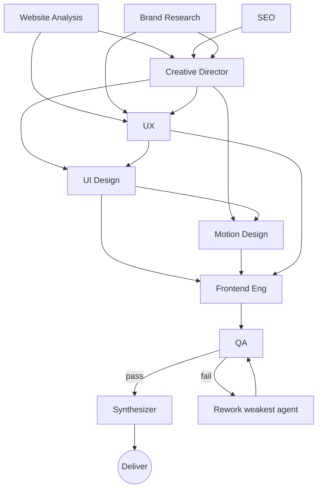
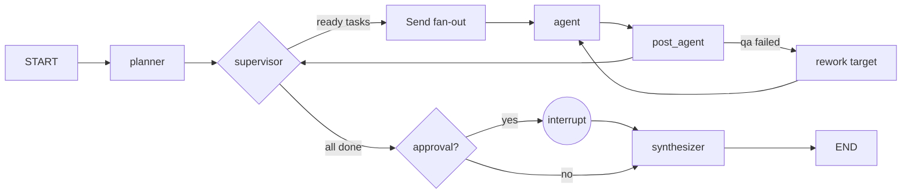

# Autonomous Multi-Agent Website Redesign Platform — System Architecture

> One prompt. Many specialised AI agents. One final result.
>
> A production-grade LangGraph orchestration platform that behaves like a
> premium digital agency: it takes a single sentence such as
> *“Redesign the homepage of https://example.com into a cinematic,
> award-winning website”* and autonomously plans, executes, reviews and
> assembles the redesign — crawling, researching, directing, designing,
> engineering and QA-ing with no manual model/tool juggling.

This document is the canonical reference for the architecture. It is written to
be read by engineers, designers and founders alike.

---

## 1. Overall System Architecture

The platform is a **layered, agent-native system**. A request enters through an
API, is handed to a LangGraph orchestrator that schedules a DAG of specialist
agents, and the agents exchange state through a shared-memory channel while
tools (crawler, search, vision, lighthouse) reach the outside world. Every step
is checkpointed for resilience and streamed to the client.

```
┌──────────────────────────────────────────────────────────────────────┐
│                         Client (web / CLI)                            │
│        POST /api/redesign  •  WS /api/redesign/{id}/ws                │
└───────────────┬───────────────────────────────────┬──────────────────┘
                │ request                            │ live events
                ▼                                    │
┌───────────────────────────────────┐               │
│   API Layer (FastAPI + WebSocket)  │◄──────────────┘
│   - job registry  - streaming  - HITL resume       │
└───────────────┬───────────────────┘
                │ (thread_id, state)
                ▼
┌──────────────────────────────────────────────────────────────────────┐
│                 Orchestration Layer (LangGraph StateGraph)             │
│                                                                        │
│   planner → supervisor ⇄ (agents → post_agent → supervisor)            │
│                    └─► [approval] ─► synthesizer ─► END                │
│                                                                        │
│   • parallel fan-out (Send)   • dependency graph   • retry loop        │
│   • checkpointer (resume)     • long-term Store    • HITL interrupt    │
└───────────────┬──────────────────────────────────────────────────────┘
                │ agents call tools + structured LLM
                ▼
┌────────────────────┐  ┌────────────────────┐  ┌──────────────────────┐
│ Tool Layer         │  │ Memory Layer       │  │ Persistence Layer     │
│ • crawl (httpx/BS4)│  │ • checkpointer PG  │  │ • PostgreSQL (jobs,   │
│ • screenshot (PW)  │  │ • Store (PG)       │  │   events, qa, memory) │
│ • web_search       │  │ • in-graph shared  │  │ • Object store (code, │
│ • lighthouse       │  │   state channels  │  │   screenshots, zip)    │
│ • vision (VLM)     │  │ • Redis pub/sub    │  │                        │
└────────────────────┘  └────────────────────┘  └──────────────────────┘
```

**Why LangGraph and not a hand-rolled loop?** LangGraph gives us, for free and
battle-tested: durable checkpointing (pause/resume/crash-recovery), a typed
state schema, first-class human-in-the-loop (`interrupt`), a supervisor/`Send`
fan-out primitive for parallelism, and a compiled graph we can visualise and
test. A custom asyncio orchestrator would re-implement all of that, worse.

---

## 2. Agent Architecture

Ten agents, each a **single responsibility** wrapped as a LangGraph node. Every
agent shares the same shape: *gather context → (optional) run tools → call a
structured LLM → write its owned channel + bookkeeping*. This uniformity is what
makes the system extensible: adding an 11th agent is a new prompt file + one
node + one `Task` in the planner.

| # | Agent | Owns (state channel) | Key inputs | Tools |
|---|-------|----------------------|------------|-------|
| 1 | **Master Orchestrator** (planner+supervisor) | `plan`, scheduling | request | — |
| 2 | Website Analysis | `analysis` | url | crawl, screenshot, vision |
| 3 | SEO | `seo` | url, analysis | crawl, lighthouse |
| 4 | Brand Research | `brand` | url, intent | web_search |
| 5 | Creative Director | `creative` | brand, analysis, seo | — |
| 6 | UX | `ux` | brand, creative, analysis | — |
| 7 | UI Design | `ui` | creative, ux, brand | — |
| 8 | Motion Design | `motion` | creative, ui, ux | — |
| 9 | Frontend Engineering | `engineering` | ui, motion, ux, seo, creative | — |
| 10 | QA | `qa` | engineering, ui, motion, seo, creative | — |

Each agent returns a **validated Pydantic model** (not free text), which is the
contract that makes agent-to-agent communication reliable. The Creative
Director's `CreativeDirection` is the *single source of truth* the UI, Motion
and Engineering agents all consume.

---

## 3. Workflow Diagrams

### 3.1 Task dependency DAG



The **analysis phase (A, B, D) runs in parallel** — none depend on each other.
Creative/UX wait for it; UI/Motion wait for Creative; Engineering waits for
UI/Motion/UX; QA waits for Engineering.

### 3.2 Runtime control flow (LangGraph)



---

## 4. Folder Structure

```
Frontend Pipeline/                 # repo root
├── redesign/                      # the platform package
│   ├── __init__.py
│   ├── config.py                  # pydantic-settings, env-driven
│   ├── schemas.py                 # all typed contracts (state sub-models, TaskPlan)
│   ├── state.py                   # RedesignState (shared memory channels)
│   ├── llm.py                     # LLM factory: simulation | openai | anthropic
│   ├── context.py                 # shared-memory read path (per-agent context)
│   ├── memory.py                  # checkpointer + long-term store (PG→memory)
│   ├── storage.py                 # artifact persistence (local / S3)
│   ├── reporting.py               # render outputs → Markdown reports
│   ├── orchestrator.py            # LangGraph graph: supervisor, retries, HITL
│   ├── runner.py                  # stream / run / resume helpers
│   ├── agents/
│   │   ├── base.py                # shared node helpers (prompt, call, finalize)
│   │   ├── nodes.py               # the 10 agent node functions + planner
│   │   └── __init__.py
│   ├── tools/
│   │   ├── crawl.py  screenshot.py  search.py  lighthouse.py  vision.py
│   │   └── __init__.py
│   ├── prompts/                   # editable prompt templates (one per agent)
│   │   ├── planner.md  website_analysis.md  seo.md  brand_research.md
│   │   ├── creative_director.md  ux.md  ui.md  motion.md  engineering.md  qa.md
│   │   └── __init__.py            # render_prompt() loader
│   └── api/
│       ├── main.py                # FastAPI: REST + WebSocket streaming + resume
│       └── __init__.py
├── scripts/run_pipeline.py        # CLI runner
├── tests/test_orchestrator.py     # offline simulation tests
├── migrations/0001_init.sql       # application DB schema
├── docs/ARCHITECTURE.md           # this document
├── docker-compose.yml  Dockerfile  requirements.txt  pytest.ini  .env.example
└── README.md
```

---

## 5. Technology Stack

| Concern | Choice | Alternatives considered | Why |
|---------|--------|-------------------------|-----|
| Orchestration | **LangGraph** | CrewAI, OpenAI Agents SDK, custom asyncio | Durable checkpoints, HITL, typed state, `Send` fan-out, visualisable graph |
| Agent LLM | **OpenAI / Anthropic** via LangChain | Gemini, local (Ollama) | Best structured-output + vision quality; provider-swappable in `llm.py` |
| API | **FastAPI + WebSocket** | Flask, Django | Async-native, WebSockets for streaming, OpenAPI docs free |
| Crawling | **httpx + BeautifulSoup** | Scrapy | Lightweight, sync/async, enough for audit surface |
| Screenshots | **Playwright** | Puppeteer, Selenium | Best headless rendering, mobile emulation |
| Vision | **VLM** (GPT-4o / Claude) | — | Screenshot → structured visual critique |
| Structured output | **Pydantic + `with_structured_output`** | JSON mode + manual parse | Validation, type safety, agent contracts |
| Checkpointer / Store | **PostgreSQL** (LangGraph PG) | Redis, SQLite | Durable, queryable, ACID; Redis for ephemeral pub/sub |
| Cache / pub-sub | **Redis** | Kafka (overkill) | Progress fan-out, simple job queue |
| Artifacts | **Local disk / S3** | GCS | Cheap, versioned code + zips |
| Container | **Docker + Compose** | K8s (later) | Reproducible dev + single-node prod |

**Key trade-off — CrewAI vs LangGraph.** CrewAI is faster to prototype role-play
but weaker on explicit DAG control, durable checkpoints and HITL interrupts,
which this product needs (retry loops, crash recovery, approval gates). LangGraph
wins for a system that must scale to thousands of jobs reliably.

**Key trade-off — one big LLM call vs many agents.** A single monolithic prompt
loses specialisation and emits inconsistent structure. The multi-agent topology
costs more tokens but yields auditable, retry-able, specialist-grade output — the
right call for an agency-grade product.

---

## 6. Database Schema

LangGraph auto-creates `checkpoints`, `writes` (per-step state) and `store`
(long-term memory) tables via `.setup()`. The application schema
(`migrations/0001_init.sql`) adds:

- **`redesign_jobs`** — one row per request: status, qa_score, artifacts path.
- **`redesign_events`** — append-only progress log (powers the live feed + replay).
- **`redesign_brand_memory`** — cross-run brand DNA (warm starts for repeat clients).
- **`redesign_qa_reports`** — historical QA gate results (tunes the retry policy).
- **`redesign_artifacts`** — manifest of generated files/reports/zips.

State is intentionally *not* blobbed in app tables — it lives in LangGraph's
checkpointer so any step can be resumed or replayed.

---

## 7. Memory Architecture

Three tiers, each with a distinct lifetime and purpose:

1. **In-graph shared memory (per run).** `RedesignState` channels — one owned
   channel per agent (`analysis`, `seo`, …). Parallel agents never write the
   same channel, so fan-out is race-free. Downstream agents read exactly the
   upstream slices they need via `context.build_context`.
2. **Checkpointer (per run, durable).** PostgreSQL snapshot of every channel at
   every step → pause/resume, crash recovery, time-travel debugging.
3. **Long-term Store (cross run).** Namespaced brand DNA / design systems keyed
   by brand → future redesigns start warmer and reuse learnings.

Redis is the *ephemeral* tier: pub/sub for streaming progress to many clients
and a lightweight job queue for horizontal workers.

---

## 8. Prompt Templates

Every agent has an editable Markdown prompt in `redesign/prompts/`, loaded by
`render_prompt()` and filled only with the `{tokens}` it actually uses (literal
braces in the template, e.g. JSON examples, are preserved). Tokens available:
`{url}`, `{brand}`, `{analysis}`, `{seo}`, `{creative}`, `{ux}`, `{ui}`,
`{motion}`, `{engineering}`, `{context}`.

| File | Drives |
|------|--------|
| `planner.md` | Master Orchestrator task-graph planning |
| `website_analysis.md` | forensic UI/UX audit |
| `seo.md` | SEO + Core Web Vitals plan |
| `brand_research.md` | Brand DNA document |
| `creative_director.md` | art direction / moodboards / system |
| `ux.md` | sitemap, IA, wireframes, CTA hierarchy |
| `ui.md` | tokens, components, responsive system |
| `motion.md` | GSAP/Framer/Lenis motion spec |
| `engineering.md` | Next.js/TS/Tailwind code generation |
| `qa.md` | 7-dimension quality gate |

Design leads can tune behaviour by editing Markdown — no code change.

---

## 9. Tool Integrations

| Tool | Module | Mode | Graceful degradation |
|------|--------|------|----------------------|
| Crawler | `tools/crawl.py` | httpx + BeautifulSoup | Returns error field on network failure |
| Screenshots | `tools/screenshot.py` | Playwright | Returns `None` if PW disabled/absent |
| Web search | `tools/search.py` | Tavily / Serper / mock | Mock provider for offline |
| Lighthouse | `tools/lighthouse.py` | `lighthouse` CLI | Returns *estimated* CWV profile |
| Vision | `tools/vision.py` | VLM (optional) | Skips if no vision provider |

All tools are **pure functions** and unit-tested; agents call them only in
`has_real_llm` mode (simulation skips live network calls for speed/offline).

---

## 10. API Design

| Method | Path | Purpose |
|--------|------|---------|
| `GET` | `/health` | liveness + provider |
| `POST` | `/api/redesign` | submit request → `{project_id}` |
| `GET` | `/api/redesign/{id}` | poll status / final artifact |
| `POST` | `/api/redesign/{id}/resume` | resume a paused (HITL) run with a decision |
| `WS` | `/api/redesign/{id}/ws` | live progress; client sends `resume` on interrupt |

**Streaming contract** (`WS` / SSE): the server emits `{type:"event", agent, step,
message, level}` frames as agents complete, `{type:"interrupt", payload}` when a
human-approval checkpoint is hit (client replies `{type:"resume", decision}`), and
`{type:"result", artifact}` at the end.

---

## 11. State Management

`RedesignState` (a Pydantic model) is the single mutable surface:

- **Owned channels** per agent avoid write races during parallel fan-out.
- **Reducers** (`_merge_status`, `_extend_no_dup`, `_merge_events`, `_last_str`)
  make concurrent updates commute safely.
- **`task_status`** (`pending/running/done/failed`) is the scheduler's source of
  truth for dependency resolution and retry bookkeeping.
- **`pending_rework` + `last_completed`** implement the QA retry loop without
  bespoke graph edges.
- The compiled graph is **checkpointed**, so state survives process restarts.

---

## 12. Failure Recovery Strategy

1. **Per-agent exceptions** are caught by `wrap_agent` (retries N times), then
   recorded as `failed` so the supervisor degrades gracefully instead of looping.
2. **Deadlock guard**: if no task is ready but not all required tasks are done,
   the supervisor synthesizes with what it has (delivering a partial result).
3. **Checkpointing**: any crash mid-run resumes from the last persisted step via
   the same `thread_id` — no lost work.
4. **QA escalation**: if QA fails past `max_qa_retries`, the run is delivered with
   defects explicitly noted in the QA report (never silently wrong).
5. **Tool failures** never crash a run — each tool returns a structured
   error/note the agent can reason about.

---

## 13. Retry Strategy

- **Agent-level** (`max_agent_retries`, default 2): transient LLM/tool errors are
  retried with backoff inside `wrap_agent`.
- **QA-level** (`max_qa_retries`, default 3): on failure the orchestrator routes
  the work back to `qa.weakest_agent`, then **re-runs QA** automatically — a true
  autonomous feedback loop. After exhaustion it escalates (delivers w/ defects).
- **Resumable**: because state is checkpointed, a retry after a crash costs only
  the remaining steps, not the whole job.

---

## 14. Security Considerations

- **Secrets**: API keys only via env / secret manager; never logged or committed
  (`.env` is git-ignored; `.env.example` ships empty).
- **SSRF**: the crawler fetches user-supplied URLs — restrict to public http(s),
  block private/link-local ranges, enforce timeouts and a max response size.
- **Prompt injection**: analysis/search content is untrusted; it is passed as
  *data*, not instructions, and outputs are schema-validated before use.
- **Generated code**: sandboxed build/typecheck before deploy; never executed on
  the host beyond `next build`.
- **Rate limits / auth**: the API should sit behind authn + per-tenant quotas in
  production (gateway/API key).
- **Tenant isolation**: `project_id` scopes artifacts, checkpoints and store
  namespaces.

---

## 15. Scalability Plan

- **Horizontal workers**: run N API replicas behind a load balancer; each run is
  a LangGraph thread identified by `project_id`, so any worker can resume it.
- **Queue**: move from inline execution to a Redis/Celery (or LangGraph Platform)
  queue so thousands of requests buffer and process concurrently.
- **Model routing**: route heavy agents (Creative, Engineering) to stronger models
  and light agents (SEO checks) to cheaper/faster ones.
- **Caching**: memoise crawls/screenshots/brand research per URL; reuse brand
  memory across runs for the same client.
- **Postgres**: connection pooling (PgBouncer); partition `redesign_events` by
  time; offload artifact blobs to S3.
- **Cost control**: cap tokens per agent, cap retries, and short-circuit the
  analysis phase with cached results.

---

## 16. Development Roadmap

- **Phase 0 — Foundation** (done): graph, 10 agents, memory, API, tests, sim mode.
- **Phase 1 — Real LLMs**: wire OpenAI/Anthropic keys; tune prompts on real sites.
- **Phase 2 — Tool hardening**: Playwright fleet, Lighthouse CI, Tavily search.
- **Phase 3 — Durable infra**: Postgres checkpointer in prod, Redis queue, workers.
- **Phase 4 — HITL product**: approval UI, diff viewer, human edit loop.
- **Phase 5 — Quality loop**: learn from QA history to auto-tune prompts/retries.
- **Phase 6 — Multi-site & CMS export**: full-site redesigns, WordPress/Webflow
  publish, A/B variant generation.

---

## 17. MVP Definition

The MVP is **exactly what this repository runs today in `simulation` mode**, then
with `LLM_PROVIDER=openai`:

- One prompt → full agent pipeline → zipped Next.js project + 9 Markdown reports.
- Parallel analysis phase, automatic QA retry loop, checkpointed state.
- REST + WebSocket streaming, plus an offline test suite.
- Everything degrades gracefully with no external services.

It is demonstrably end-to-end; the remaining work is *quality* (real models,
hardened tools, HITL UI), not *structure*.

---

## 18. Production Deployment Plan

1. **Build & push** the Docker image; deploy `postgres` + `redis` + `app`
   (compose for single node, K8s for scale).
2. **Provision secrets** (LLM keys, DB DSN, S3) via secret manager; set
   `LLM_PROVIDER=openai`, `HUMAN_APPROVAL_ENABLED` as desired.
3. **Migrate DB** (`migrations/0001_init.sql`); LangGraph `.setup()` creates its
   own tables on first run.
4. **Scale workers** behind a queue; put the API behind authn + rate limiting.
5. **Observe**: log every `redesign_events` row; dashboard QA scores, retry
   rates, token cost per agent.
6. **Harden SSRF / sandbox** before allowing arbitrary public URLs in production.

---

### Running it now

```bash
python -m venv .venv && . .venv/bin/activate
pip install -r requirements.txt
export LLM_PROVIDER=simulation        # or openai with OPENAI_API_KEY
python scripts/run_pipeline.py "Redesign https://example.com into a cinematic site"
# API:  uvicorn redesign.api.main:app --reload   → http://localhost:8000/docs
```

The system runs **fully offline in simulation mode** (no API keys, no network),
so the orchestration, parallelism, retry loop and delivery can be validated
immediately; switching `LLM_PROVIDER` to a real provider upgrades it to
production-grade generation with zero code changes.
